# Data Engineer - Assignment

An Apache Airflow-based ETL pipeline that extracts  csv files into table customers.

---

## 📁 Project Structure

```
├── config/
│   ├── test_de/sql/
│   │   └── report_script.sql       # SQL script for reporting
│   └── test_de_config/
│       └── variable.json           # Airflow variable configurations
├── dags/
│   └── customer_etl_dag.py # Main Airflow DAG definition
├── dataset/
│   └── customers.csv               # Source customer data
├── logs/                           # Airflow task logs
├── plugins/                        # Custom Airflow plugins
├── sql/
│   ├── create_table.sql            # DDL for target tables
│   └── mock_data.sql               # Mock data for local testing
├── docker-compose.yaml             # Docker services configuration
├── Dockerfile                      # Custom Airflow image
├── er_diagram.png                  # Entity-relationship diagram
└── requirements.txt                # Python dependencies
```

---

## ⚙️ Prerequisites

- [Docker](https://www.docker.com/) & Docker Compose
- Python 3.8+
- Apache Airflow 2.x
- DBeaver

---
## 📊 ER Diagram

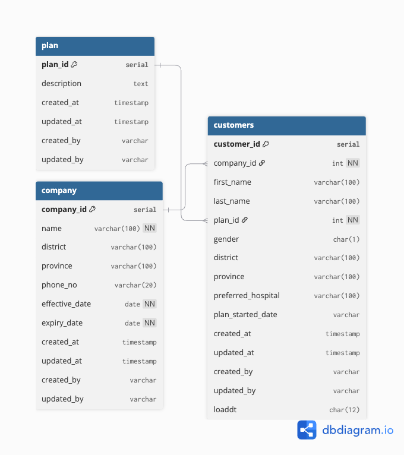

---

## Get Started

### 1. Clone the repository
 
```bash
git clone https://github.com/BallJedsadakorn/dataengineer_assignment.git
cd dataengineer_assignment
```
### 2. Build and start services
 
```bash
docker compose up --build
```
If you don't see any table in Postgresql try delete the volume and recreate
```bash
docker compose down -v
docker compose up
```

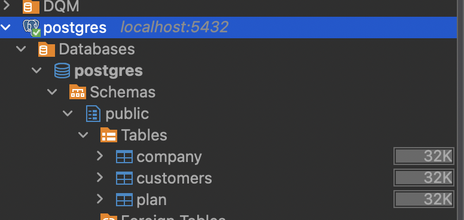


### 3. Access the Airflow UI
 
Open your browser and go to:
 
```
http://localhost:8080
```
Default credentials:
- **Username:** `airflow`
- **Password:** `airflow`

### 4. Manual add Airflow Connection
 
- **Connection Id** : `postgres_localhost`
- **Connection Type** : `Postgres`
- **Host** : `host.docker.internal`
- **Database** : `postgres`
- **Login** : `airflow`
- **Password** : `airflow`
- **Port** : `5432`

### 5. When finished add Airflow Connection

u can open dag and try run pipeline

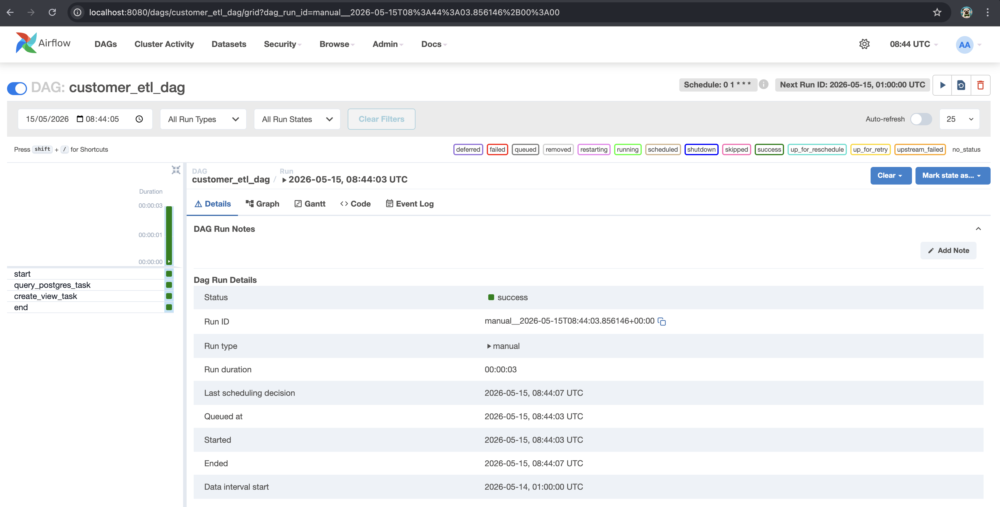

This is a simple pipeline that extract csv file into customers table then create view in Postgresql.
 

### 6. Manual Add Connection in DBeaver

Open DBeaver

- **Host** : `localhost`
- **Port** : `5432`
- **Database** : `postgres`
- **Username** : `airflow`
- **Password** : `airflow`

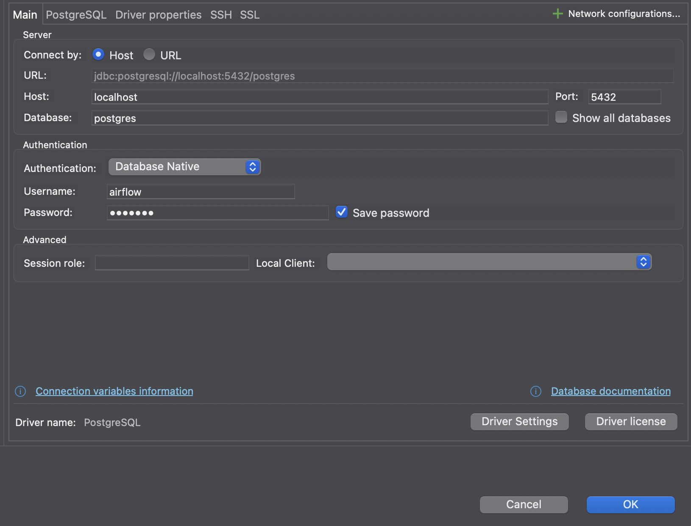
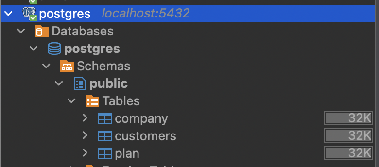

You can try run Query from here
the SQL query are in `config/test_de/sql/report_script.sql or look for data and Views below`

**Write the SQL query for business reporting**

**3.a.**
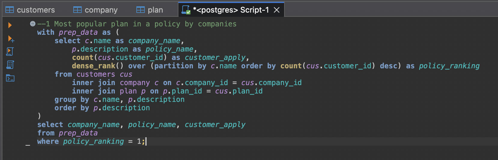
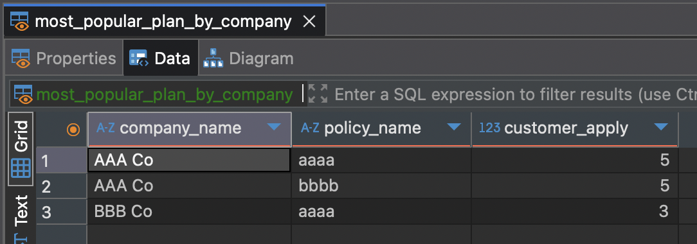
**3.b.**
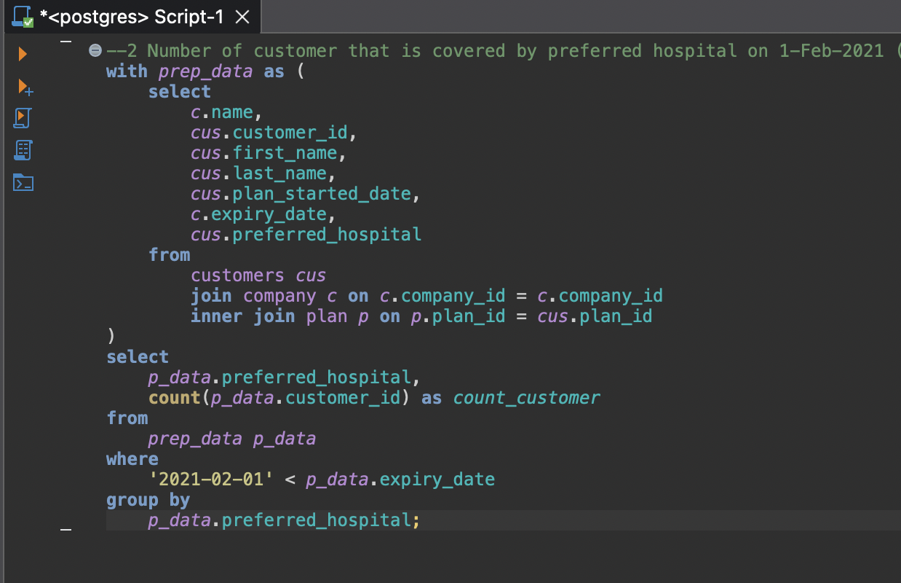
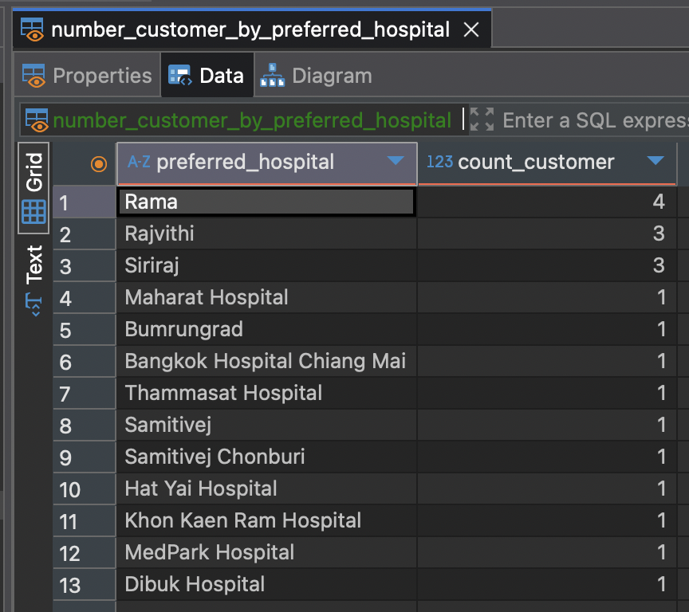
**3.c.**
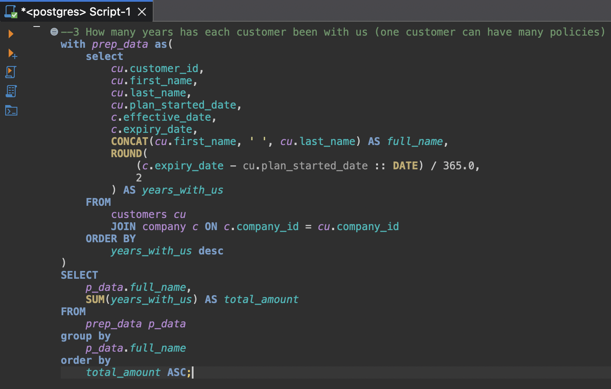
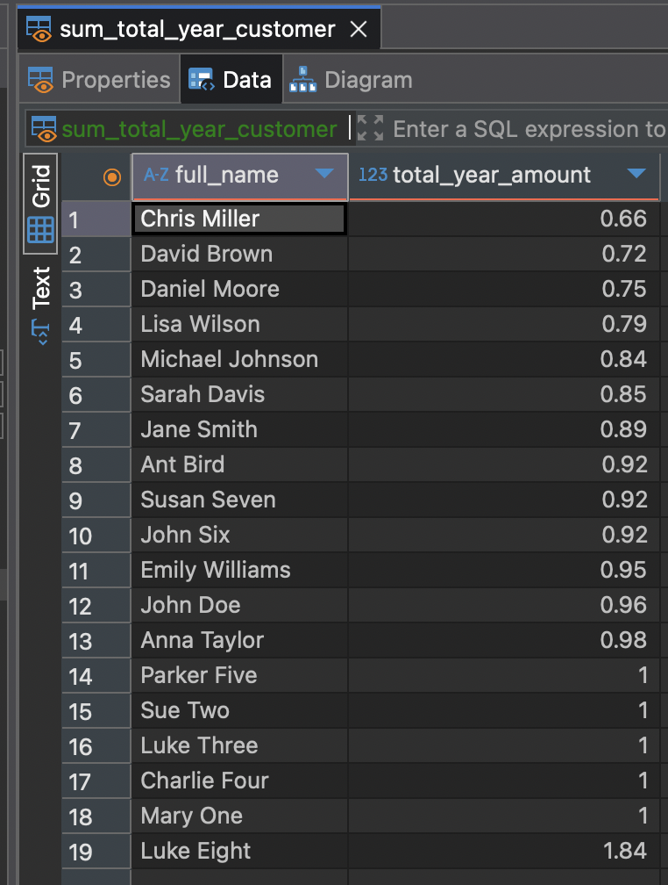

---